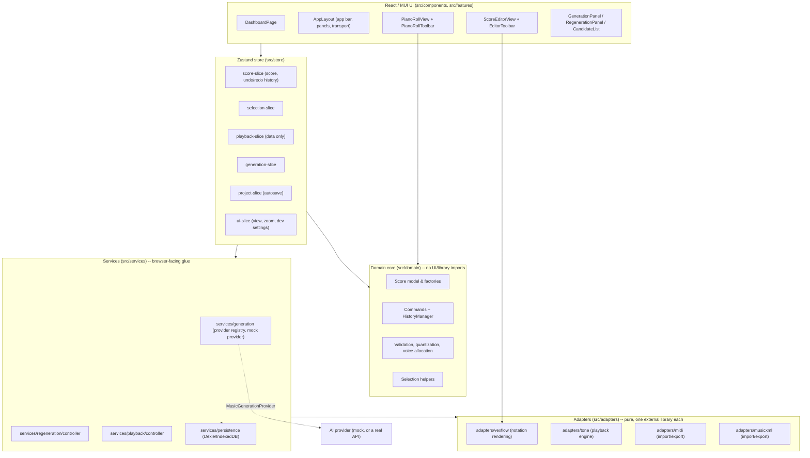

# ScoreSmith architecture

This document explains how ScoreSmith is put together: the layering, the internal score model, the rendering and playback pipelines, MIDI import, the regeneration workflow, how to plug in a real AI provider, known limitations, keyboard shortcuts, and troubleshooting. The authoritative product/behavior spec is [`docs/spec.md`](spec.md); this document explains *how* the codebase satisfies it.

## Contents

- [Layers](#layers)
- [The internal score model](#the-internal-score-model)
- [Rendering pipeline](#rendering-pipeline)
- [Playback scheduling](#playback-scheduling)
- [MIDI import pipeline](#midi-import-pipeline)
- [Regeneration workflow](#regeneration-workflow)
- [Adding a real AI provider](#adding-a-real-ai-provider)
- [Testing](#testing)
- [Known limitations](#known-limitations)
- [Keyboard shortcuts](#keyboard-shortcuts)
- [Troubleshooting](#troubleshooting)

## Layers

ScoreSmith is layered "domain-out": a UI-framework-free core, pure adapters around it for each external library, a Zustand store gluing adapters to state, and React/MUI on top. The core design constraint (spec §37) is that **the canonical score model is the single source of truth** — VexFlow objects, Tone.js objects, and MIDI/MusicXML are never stored in application state, only ever derived from or converted into the score model on demand.



- **`src/domain`** — the score model, tick/fraction/pitch math, validation, quantization, voice allocation, selection helpers, and the command/undo system. Zero imports from React, MUI, VexFlow, Tone.js, `@tonejs/midi`, or Dexie (spec §37.14), so it runs identically in the browser, in Vitest/jsdom, and in a Node script.
- **`src/adapters`** — one pure module per external library: `vexflow` (score → SVG), `tone` (score → scheduled audio), `midi` (MIDI ⇄ score), `musicxml` (MusicXML ⇄ score). Each adapter is a one-directional or round-trip *translation*, never a place score state lives.
- **`src/services`** — the browser-facing glue that isn't itself a UI component: the generation provider registry and seeded mock provider, the regeneration controller, the playback controller (the one place real-time Tone.js control happens, deliberately outside the Zustand action pattern — see [Playback scheduling](#playback-scheduling)), and Dexie-backed persistence.
- **`src/store`** — one Zustand store (`useAppStore`/`createAppStore`) composed from slices (`score`, `selection`, `playback`, `generation`, `project`, `ui`), wired with Immer so every action writes to a mutable-looking draft. This is where domain code and services meet React.
- **`src/components` / `src/features`** — the React/MUI UI: app shell, dashboard, score editor, piano roll, generation/regeneration panels, transport, inspector, dialogs.

## The internal score model

Defined in `src/domain/score/types.ts` (spec §4). A `Score` is:

```
Score { id, version, ppq, metadata, tempoMap: TempoEvent[], tracks: Track[] }
Track { id, name, instrumentName, midiProgram, midiChannel, clef, volume, pan, muted, solo, measures: Measure[] }
Measure { id, index, startTick, durationTicks, timeSignature, keySignature, voices: Voice[] }
Voice { id, name, events: MusicalEvent[] }
MusicalEvent = NoteEvent | RestEvent   // NoteEvent has a `pitch`; RestEvent doesn't (isNoteEvent/isRestEvent)
```

Everything is measured in integer **ticks** at a fixed internal resolution (`ppq = 480`, spec §4/§15) — never floating-point seconds (spec §37.6). Seconds only exist transiently, computed from the score's `tempoMap` at the moment something needs to talk to Tone.js. Pitch is spelled, not just a MIDI number (`{ step, accidental, octave }`), so enharmonic spelling survives round-trips and renders correctly.

**Every mutation goes through a command** (spec §37.7): `src/domain/commands/*` exports factories like `changePitchCommand`, `moveNotesCommand`, `replaceRegionCommand`, `changeTempoCommand`, each an `{ apply, invert }` pair (or an internal snapshot-based inverse — see `commands/snapshot.ts`) that `score-slice`'s `HistoryManager` pushes onto an undo/redo stack. UI code never mutates a `Score` object directly; it always calls `store.getState().dispatchCommand(someCommand(...))`.

## Rendering pipeline

`src/adapters/vexflow` turns a `Score` into an SVG the DOM can show, and back into DOM-element/id maps the UI needs for hit-testing and highlighting:

1. **`layout.ts`** decides system/row breaks and each measure's on-screen box, in logical (pre-zoom) pixels, for either "page" (wraps to a fixed width) or "continuous" (one long row) layout mode. Heuristic by design (spec §26: layout only needs to be "practical", not typeset-perfect).
2. **`convert.ts`** turns each measure's voices into VexFlow `StaveNote`s/`Voice`s/`Beam`s, tagging every drawn note/rest with a `vexId` attribute so the DOM element VexFlow eventually draws can be found again afterward.
3. **`renderer.ts`** (`VexFlowScoreRenderer`) draws the actual staves/clefs/key-and-time-signatures/notes/ties into a container `<div>`'s SVG, applying `zoom` as a single `context.scale(zoom, zoom)` so glyphs and spacing scale together.
4. **`id-map.ts`** walks the drawn SVG afterward and builds `idToElement`/`idToBBox` (domain event id → drawn element/bounding box) and `measureIdToBBox`, purely by querying `[id="vf-<id>"]` — no VexFlow-internal bookkeeping leaks past this point.

`ScoreEditorView` (the React component) owns the `VexFlowScoreRenderer` instance in a ref (never in Zustand — spec §37.2) and re-invokes `render()` when the score/zoom/layout change, then repaints selection/playback/preview highlights separately (`applyHighlights`) without a full re-render on every selection change. For long scores, only the measures whose system intersects the scrolled viewport (plus overscan) are actually drawn (spec §26/§29 virtualization) — `layout.ts` still computes every measure's box (cheap), but `convert.ts`/VexFlow only draws the visible window.

The piano roll (`src/features/piano-roll`) is a second, independently-rendered view of the **same** score/selection — not a VexFlow view, but plain absolutely-positioned `<div>`s computed by `geometry.ts`'s pure tick↔x / MIDI↔y math. Both views read the same store and dispatch the same commands, so an edit made in either one is immediately reflected in the other (spec §37.12: "rendering and playback must consume the same canonical score").

## Playback scheduling

`src/adapters/tone/tone-engine.ts` (`TonePlaybackEngine`) is the only place Tone.js is touched. The timing model (spec §10):

- `Tone.getTransport().bpm` is set **once**, to a fixed base of 60, and never changed again. ScoreSmith's own `TempoMap` (built from the score's tempo curve, via `domain/time`) is the sole authority for "what real second does score-tick T fall at" (`ticksToSeconds`). That computed second — divided by the current `tempoMultiplier` (the transport's playback-speed control) — is what actually gets handed to Tone's `schedule`/`loopStart`/`loopEnd`/`seek` APIs.
- Because of that, changing playback speed requires actually re-scheduling every already-scheduled event (cancel + reschedule + re-seek to the equivalent position) rather than nudging a single Tone "speed" knob — this keeps one single source of truth for "what second is this" instead of reconciling two independent tick/second systems.
- Every track gets its own `InstrumentHandle` (`adapters/tone/instruments.ts`), picked by a rough GM-program-number → instrument-category mapping; there is no "stop everything now" escape hatch on an instrument handle, so anywhere playback needs to guarantee silence (pause/stop/seek/a live tempo change) disposes and rebuilds every track's instrument rather than trying to track down and release individual still-sounding notes.

`src/services/playback/controller.ts` (`PlaybackController`, exposed as the `playbackController` singleton) is the bridge between the engine and the Zustand store, and is deliberately **not** part of the store-action/command pattern: playback is real-time device control (spec §22), not score history, so `TransportBar` calls `playbackController.togglePlay()`/`.seek()`/`.setTempoMultiplier()` etc. directly rather than dispatching a `ScoreCommand`. The one exception is the tempo (BPM) *value itself* — editing that is a real, persisted, undoable score edit (`changeTempoCommand`), unlike the ephemeral playback-speed multiplier.

## MIDI import pipeline

`src/adapters/midi/import.ts`, built on `@tonejs/midi` (spec §15's sanctioned exception to the "no non-domain library in adapters" rule for exactly this one case). MIDI stores **performance timing**, not notation semantics, so import is necessarily an approximation — every result carries a `warnings` array the UI is required to surface, never silently discarded:

1. **Analyze** (`analyze.ts`) — per-track summary (name, channel, program, note count, duration) shown in the import wizard before anything is committed.
2. **Quantize** (optional, `domain/quantization`) — snap note starts/durations to a grid, with triplet detection.
3. **Voice allocation** (`domain/voicing/allocate.ts`) — assigns overlapping notes on one track to separate notated voices (max 4 per staff).
4. **Measure assembly** (`measures.ts`) — reconstructs the tick-based measure grid from the source file's time-signature/tempo changes, normalized to the score model's fixed `ppq = 480`.
5. **Key detection** (`key-detection.ts`, optional) — best-effort key signature guess.
6. **Sustain-pedal handling, piano staff-split, clef assignment, near-duplicate merging** — all configurable via `MidiImportOptions`, surfaced as controls in `MidiImportWizard`.

Per spec §37.11, an imported score is always **previewed** (the wizard's note-count/first-notes preview and warnings) before it's committed, and commits as exactly **one** undoable `importScoreCommand` (spec §15: "Import must be one undoable operation") — either folded into a brand-new project (no existing work to lose) or, if a project is already open, confirmed as a destructive replace first.

MusicXML import/export (`src/adapters/musicxml`) follows the same shape for a smaller feature set (spec §17 "basic MusicXML"): unsupported-but-valid elements are always skipped safely and reported in `warnings`, never silently dropped or blocking the import outright.

## Regeneration workflow

Whole-score generation (`GenerationPanel`) replaces the entire committed score in one step. Regenerating a *passage* (`RegenerationPanel`) is a non-destructive preview-then-accept workflow (spec §12/§13, spec §37.9/10):

1. **Prepare** (`services/regeneration/controller.ts`'s `prepareRegenerationRequest`) turns the current selection into a `ScoreRange` (expanding a partial-measure selection to full measure boundaries — regeneration always replaces whole measures — and reporting that expansion back to the UI to explain it) and extracts three `ScoreFragment`s: the selected region, and its preceding/following context (up to 2 measures each), so the provider has surrounding material to stay musically coherent with.
2. **Request** — `getProvider().regenerateRegion(...)` returns 1–3 `RegenerationCandidate`s (`{ id, label, fragment }`). Nothing about the committed score changes yet.
3. **Preview** — `generation-slice` tracks `candidates`/`activeCandidateId`/`previewFragment` entirely separately from `score`. `CandidateList` overlays the active candidate's fragment onto the rendered score/piano-roll (and can preview-play it against the surrounding, unmodified context) purely as a display overlay — selecting or A/B-comparing a candidate never touches the committed score.
4. **Accept** — `acceptCandidate()` turns the chosen candidate's fragment into a single `replaceRegionCommand` (`domain/commands/region-commands.ts`) and dispatches it through the normal command/undo pipeline. `replaceFragment` (`domain/score/fragment.ts`) splices the candidate's measures into the score in place of the ones the original range overlapped — so **only** the measures that were actually selected (after boundary expansion) change; everything before and after is untouched, and the whole replacement is undoable as one action (spec §37.10).
5. **Reject/retry** — `rejectCandidates()` discards the preview state with no score change at all; "Retry" re-runs `regenerate()` with a revised instruction, replacing the previous candidate set.

Every generated/regenerated result (including the mock provider's) is run through `sanitizeGeneratedScore`/response validation (spec §37.8: "every AI-generated response must be validated") before it's ever adopted, so a malformed provider response can't corrupt the committed score.

## Adding a real AI provider

Every generation path (`GenerationPanel`, `RegenerationPanel`) calls through `services/generation/registry.ts`'s `getProvider()` — a single module-level `MusicGenerationProvider`. Swapping in a real AI backend means implementing that interface (`src/services/generation/types.ts`) and calling `setProvider(...)` once at startup; nothing in the UI, store, or regeneration controller needs to change.

```typescript
// MusicGenerationProvider (src/services/generation/types.ts):
export interface MusicGenerationProvider {
  id: string;
  name: string;
  generateScore(request: GenerateScoreRequest, signal?: AbortSignal): Promise<GenerateScoreResult>;
  regenerateRegion(request: RegenerateRegionRequest, signal?: AbortSignal): Promise<RegenerateRegionResult>;
}
```

A sketch of a real provider that asks an LLM to emit the score as JSON matching the domain schema, then validates it before returning (never trusting the model's output directly — spec §37.8):

```typescript
// src/services/generation/openai-provider.ts (sketch -- not wired in by default)
import { scoreSchema } from '@/domain/score/schema';
import { sanitizeGeneratedScore } from '@/services/generation/validate-response';
import type {
  GenerateScoreRequest,
  GenerateScoreResult,
  MusicGenerationProvider,
  RegenerateRegionRequest,
  RegenerateRegionResult,
} from '@/services/generation/types';

export class OpenAiProvider implements MusicGenerationProvider {
  readonly id = 'openai';
  readonly name = 'OpenAI';

  constructor(private readonly apiKey: string, private readonly model = 'gpt-5') {}

  async generateScore(request: GenerateScoreRequest, signal?: AbortSignal): Promise<GenerateScoreResult> {
    const response = await fetch('https://api.openai.com/v1/responses', {
      method: 'POST',
      signal,
      headers: {
        Authorization: `Bearer ${this.apiKey}`,
        'Content-Type': 'application/json',
      },
      body: JSON.stringify({
        model: this.model,
        // Ask for the canonical score model directly, as strict JSON --
        // ticks (not seconds), spelled pitches, the exact measure/voice
        // shape `scoreSchema` expects. See `docs/spec.md` §4 for the full
        // shape and `domain/score/schema.ts` for the Zod schema an LLM
        // response must satisfy.
        input: buildGenerationPrompt(request),
        response_format: { type: 'json_schema', json_schema: scoreJsonSchema },
      }),
    });
    if (!response.ok) throw new Error(`OpenAI generateScore failed: ${response.status} ${await response.text()}`);

    const raw = scoreSchema.parse((await response.json()).output_parsed);
    // Never trust a model's output directly (spec §37.8): repairs/rejects
    // structurally-invalid output the same way the mock provider's own
    // results are checked before ever being adopted.
    const { score, warnings } = sanitizeGeneratedScore(raw);
    return { score, warnings };
  }

  async regenerateRegion(request: RegenerateRegionRequest, signal?: AbortSignal): Promise<RegenerateRegionResult> {
    // Same shape: send `request.precedingContext`/`selectedFragment`/
    // `followingContext` + `request.instruction`/`constraints` as prompt
    // context, ask for `request.candidateCount` alternatives, validate
    // each returned fragment before returning it as a `RegenerationCandidate`.
    throw new Error('not implemented in this sketch');
  }
}

// Elsewhere, at app startup (e.g. src/app/App.tsx), in place of the default mock provider:
// setProvider(new OpenAiProvider(import.meta.env.VITE_OPENAI_API_KEY));
```

A few things any real provider implementation needs to preserve, since the rest of the app assumes them:

- **Always return ticks, never seconds** (spec §37.6), at the score's own `ppq`.
- **Respect `RegenerationConstraints`** (`preserveMeasureCount`/`preserveTimeSignatures`/`preserveTempoEvents` are always `true`; the optional `preserveHarmony`/`preserveRhythm`/`preserveMelody`/`preserveBoundaryNotes` reflect the user's checkboxes) — a regenerated fragment that changes the measure count or time signature will fail validation.
- **Return exactly `request.candidateCount` candidates** (1–3) from `regenerateRegion`, each with a stable, human-readable `label`.
- **Support cancellation** via the passed `AbortSignal` — the store's `generate()`/`regenerate()` actions abort an in-flight request whenever a newer one supersedes it (e.g. the user edits the prompt and hits Generate again).
- **Never throw on merely "creative" output** — throw only for genuine failures (network error, invalid API key); let `sanitizeGeneratedScore`/schema validation be what decides whether the *content* is acceptable.

## Testing

Three layers, matching spec §30:

- **Unit tests** (`*.test.ts` next to the modules they cover) — fraction/tick/pitch/duration math, transposition, measure length, note splitting, tie generation, tempo conversion, quantization, voice allocation, score validation, MIDI/MusicXML import and export, command execution/undo, region replacement, generation response validation, persistence migrations.
- **Component tests** (`*.test.tsx`, Vitest + Testing Library + jsdom) — every interactive component in isolation: toolbars, transport, track list, inspector, generation panel, import dialogs, selection behavior, regeneration preview, error dialogs.
- **End-to-end tests** (`e2e/*.spec.ts`, Playwright + real Chromium) — the app driven exactly as a user would, covering all 15 spec §30 scenarios grouped into spec files (`project-generate-play`, `select-edit-undo`, `regeneration`, `midi-roundtrip`, `musicxml-export`, `persistence`, `view-switch-piano-roll`) plus one comprehensive run of the full [spec §39 acceptance scenario](spec.md#39-acceptance-criteria) (`acceptance.spec.ts`).

**Deterministic e2e fixtures**: every e2e test navigates with a `?seed=<value>` URL query param (`e2e/helpers.ts`'s `SEED`), which `App.tsx` reads on load and applies to `devSettings.seed` — the same mechanism `DeveloperSettingsDialog`'s seed field uses (`services/generation/registry.ts`'s `setMockSeed`) — so the mock provider's output for a given prompt/request is exactly reproducible across runs. A `?seed=` value is a **per-visit override only**: `App.tsx` deliberately does not write it back to IndexedDB as though it were a real settings change (a `skipNextSeedPersist` ref suppresses exactly that one persist call) — otherwise a single `?seed=42` visit would silently overwrite whatever seed was actually stored, and every later visit *without* the param would keep loading "42" forever. A real seed change made through Developer Settings still persists normally. MIDI/MusicXML import fixtures aren't checked into the repo as binary files; each test generates one at run time by exporting from the app itself and importing that exact file back in (round-tripping through the real export/import code paths, rather than a fixture that could silently drift from what the app actually produces).

**The `__SCORESMITH_STORE__` test hook**: `src/app/App.tsx` exposes the live Zustand store as `window.__SCORESMITH_STORE__` (and the Dexie db as `window.__SCORESMITH_DB__`) whenever `import.meta.env.DEV` is true (i.e. always under `npm run dev`, which is what Playwright's `webServer` boots) — gated on that alone, with no query-param opt-in, so it never ships in a production build regardless of the URL it's served at. Two things about this suite specifically lean on it, both explained in `e2e/helpers.ts`'s module doc:
- Real Tone.js audio needs a user gesture and produces no observable signal in headless Chromium, so playback assertions read `state`/`positionTick` off the store instead of listening for sound.
- The *workflow* tests select an exact multi-measure range (e.g. "measures 3 and 4", for the regeneration flow) by calling `selectMeasures` through the hook rather than pixel-clicking VexFlow's rendered SVG, when the point of the test is what happens *after* selection, not the click gesture itself.

That second point has one deliberate exception: `regeneration.spec.ts` also has a small, dedicated test ("selects a measure via a real click on its rendered stave") that exercises `ScoreEditorView`'s actual click-based measure hit-test end to end with a genuine `page.mouse.click`. A measure's stave is drawn as thin painted line strokes, not a filled measure-wide hit region (most points inside its bounding box hit nothing), so `findMeasureStaveClickPoint` (`e2e/helpers.ts`) probes a handful of candidate points along the stave's own rendered middle line via real `elementFromPoint` hit-testing until one actually resolves to that measure's group, then clicks there for real — genuinely covering the real-browser click path spec §30 scenario 7 describes, without hard-coding a pixel offset that would silently drift with engraving changes.

Both the notation and piano-roll views virtualize long scores to the scrolled viewport (spec §26/§29), so e2e assertions about "notes rendered" check that *some* real notes are present (and, where it matters, scroll the specific element into view first) rather than an exhaustive count — an off-screen note is still a correctly-loaded note, just not currently drawn.

## Known limitations

Deliberately out of scope for this MVP (spec §38 — "future work", not implemented):

lyrics · guitar tablature · percussion notation engraving · complex tuplets · cross-staff beaming · grace notes · advanced ornaments · ossia staves · microtonal notation · professional page-layout controls · real-time collaboration · audio recording · VST plug-ins · full MuseScore compatibility.

A few narrower, implementation-level limitations worth calling out explicitly:

- **No cross-track note move in the piano roll.** Dragging a note into the voice-lane strip reassigns its *voice* within the same track (there is no "move to a different track" command in `domain/commands/note-commands.ts`) — see `features/piano-roll/interactions.ts`'s `commitVoiceChange` doc comment.
- **MusicXML import is single-clef-per-track.** A part with more than one clef in the source file keeps only the first clef encountered; later clef changes are dropped with a warning in the import result, never silently.
- **The piano uses a synthesizer fallback, not sampled audio.** `adapters/tone/instruments.ts` maps GM program numbers to Tone.js synth voices by category — there are no bundled multi-sampled instrument recordings, so playback is a reasonable approximation of timbre, not a realistic piano recording.
- **Tempo editing only affects the first tempo event.** `TransportBar`'s tempo field edits `score.tempoMap[0]`; a score with multiple tempo changes (e.g. from a MIDI import with tempo automation) can't have its later tempo events edited from the transport UI.

## Keyboard shortcuts

The score editor (`useEditorShortcuts.ts`) — active whenever focus isn't inside a text input/select/dialog:

| Keys | Action |
| --- | --- |
| `Space` | Play / pause |
| `Escape` | Clear selection |
| `Delete` | Delete selected notes |
| `Ctrl/Cmd+Z` | Undo |
| `Ctrl/Cmd+Shift+Z` | Redo |
| `Ctrl/Cmd+C` | Copy |
| `Ctrl/Cmd+X` | Cut |
| `Ctrl/Cmd+V` | Paste |
| `ArrowUp` / `ArrowDown` | Move pitch up/down a semitone |
| `Shift+ArrowUp` / `Shift+ArrowDown` | Move pitch up/down an octave |
| `ArrowLeft` / `ArrowRight` | Move selection backward/forward |

Also shown in-app via the app bar's "Keyboard shortcuts" (`?`) button.

## Troubleshooting

**Playback doesn't start / no sound on first Play.** Browsers require a user gesture before Web Audio can produce sound (autoplay policy). ScoreSmith's `AudioContext` starts on the first real click of the Play button, so playback should always work after a genuine user click; if it doesn't, check the browser console for a suspended-`AudioContext` warning, and make sure nothing (a browser extension, an automated test) is dispatching a synthetic click that the browser doesn't treat as a trusted gesture.

**Playback stutters or drifts in a background tab.** Browsers throttle `requestAnimationFrame` and timers in backgrounded tabs to save power; Tone.js scheduling itself is driven by the Web Audio clock (not affected), but UI-side effects that poll on an animation frame (e.g. scroll-into-view during playback) can visibly lag behind actual audio while the tab is backgrounded. This is expected browser behavior, not a ScoreSmith bug — keep the tab focused for smooth visual sync.

**"Failed to load projects" / IndexedDB errors.** IndexedDB has a per-origin storage quota; a browser profile with many large projects (or other sites sharing tight storage limits, e.g. Safari's per-site cap) can hit it. Developer Settings (spec §33, behind the developer-mode toggle in the app bar's settings menu) has a "Reset local database" action; otherwise, clearing the site's storage from the browser's own settings resolves a quota error at the cost of losing local projects (export important projects as Project JSON first).

**`npm run test:e2e` fails immediately with a browser-not-found error.** Playwright needs its own browser binary, separate from any system-installed Chrome:

```bash
npx playwright install chromium
```

**`npm run test:e2e` hangs waiting for the dev server.** The suite's `webServer` config runs `npm run dev` and waits for `http://localhost:5173` to respond; if port 5173 is already in use by another process, stop it first (Playwright's `reuseExistingServer` will otherwise happily reuse *whatever* is already listening there, which may not be this project).
