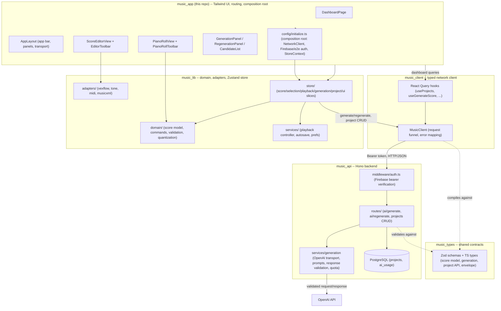

# ScoreSmith architecture

ScoreSmith is a browser-based, AI-assisted sheet-music composition app, split across **six repos** under a shared `@sudobility` scope. This document explains how those repos fit together, the request flows between them, the store-context injection pattern, known limitations, keyboard shortcuts, and troubleshooting. The authoritative product/behavior spec is [`docs/spec.md`](spec.md); this document explains _how_ the codebase satisfies it.

## Contents

- [The six repos](#the-six-repos)
- [Repo diagram](#repo-diagram)
- [Request flows](#request-flows)
- [The store-context injection pattern](#the-store-context-injection-pattern)
- [The internal score model](#the-internal-score-model)
- [Rendering pipeline](#rendering-pipeline)
- [Playback scheduling](#playback-scheduling)
- [MIDI import pipeline](#midi-import-pipeline)
- [Regeneration workflow](#regeneration-workflow)
- [Testing](#testing)
- [Known limitations](#known-limitations)
- [Keyboard shortcuts](#keyboard-shortcuts)
- [Troubleshooting](#troubleshooting)

## The six repos

| Repo                                                     | npm package                          | Role                                                                                                                                                                                                                                                                                                                                                         |
| -------------------------------------------------------- | ------------------------------------ | ------------------------------------------------------------------------------------------------------------------------------------------------------------------------------------------------------------------------------------------------------------------------------------------------------------------------------------------------------------ |
| [`music_types`](https://github.com/johnqh/music_types)   | `@sudobility/music_types`            | Shared TypeScript types + Zod schemas: the score model, generation contracts, project API shapes, the `{success,data,error,code}` response envelope. No logic, no I/O — the contract every other repo compiles against.                                                                                                                                      |
| [`music_client`](https://github.com/johnqh/music_client) | `@sudobility/music_client`           | Typed network client (`MusicClient`) + React Query hooks for `music_api`. Zero direct `fetch` calls — takes an injected `NetworkClient` (SudojoClient DI pattern).                                                                                                                                                                                           |
| [`music_lib`](https://github.com/johnqh/music_lib)       | `@sudobility/music_lib`              | The entire non-UI application layer: the domain score model, undoable commands, validation/quantization/voicing, VexFlow/Tone.js/MIDI/MusicXML adapters, and the Zustand app store. Calls `music_api` through an injected `MusicClient`, not directly.                                                                                                       |
| [`music_api`](https://github.com/johnqh/music_api)       | `music_api` (private, not published) | Backend: Hono + Drizzle ORM + PostgreSQL, Firebase-authenticated. Proxies AI generation through OpenAI (the API key never reaches the browser) and persists per-user projects.                                                                                                                                                                               |
| [`music_io`](https://github.com/johnqh/music_io)         | `@sudobility/music_io`               | Platform implementations of the interfaces in `music_types`: audio playback, XML parsing, file export and the MIDI codec, for web and React Native. A `react-native` export condition means consumers write one import and Metro or Vite each resolve their own build. Runtime dependencies are empty by design; every platform library is an optional peer. |
| `music_app` (this repo)                                  | `scoresmith` (private)               | The web app: routing, page-level React components, Tailwind styling, and the composition root that wires `music_client`/`music_lib` together with real browser services (fetch, Firebase auth, `localStorage`). No business logic lives here — see [Known limitations](#known-limitations) for what that means in practice.                                  |

Dependency direction is strictly one-way: `music_app` → `music_lib` → `music_client` → `music_types`, with `music_api` depending only on `music_types`. No package ever depends on something that depends on it.

`music_io` sits alongside that chain rather than in it. It implements interfaces declared in `music_types`, and peer-depends on `music_lib` for the domain knowledge its playback engine needs (scheduling a score, GM instrument lookup). That is one-way too: `music_lib` reaches for `music_io` **only in its tests**, and only through `music_io/mocks`, which imports nothing of ours. The app's composition root is the single place both are constructed and joined — `createMusicIo()` builds the platform bundle and `initializeMusicPlatform()` hands `music_lib` the playback engine it resolves lazily on first use.

The point of the split is that `music_lib` contains no platform library at all — its runtime dependencies are exactly `immer`, `vexflow` and `zod` — so the same domain logic runs unchanged in a browser and in React Native. Three guard tests in `music_lib` fail the build if an audio or MIDI import, a platform dependency, or a DOM global creeps back in.

## Repo diagram



## Request flows

### Auth token → `MusicClient` → `music_api` → OpenAI

1. `music_app`'s composition root (`src/config/initialize.ts`) builds one `AuthBackend` — Firebase (`firebaseBackend()`) in normal use, or a fixed-identity e2e shim (`e2eBackend()`, gated on `VITE_E2E=1`) under Playwright.
2. That backend's `getToken()` is wired into `music_lib`'s `StoreContext.getToken` — the store never touches Firebase directly, it only knows "call this function to get a bearer token right before a request."
3. Every `music_client` call (`MusicClient`'s single `request<T>()` funnel, or a React Query hook built on it) calls `getToken()` fresh per request, sends it as an `Authorization: Bearer <token>` header, and never caches or stores it.
4. `music_api`'s `authMiddleware` verifies the Firebase ID token (or, in `AI_TEST_MODE`, accepts a fixed `TEST_AUTH_BYPASS_TOKEN` as a stand-in "test-user" identity — e2e/test only, never enabled in production) and sets `userId`/`userEmail` request context; every route except `/health` requires it.
5. `POST /ai/generate` / `POST /ai/regenerate` check the caller's daily quota (`AI_DAILY_LIMIT`), call OpenAI server-side with `OPENAI_API_KEY` (which never reaches the browser), and run the model's response through schema validation/sanitization (`sanitizeGeneratedScore`-equivalent on the API side) before it's returned — untrusted model output is never persisted or forwarded as-is.
6. The response comes back through the same envelope shape (`{success,data,error,code}`, from `music_types`) that `MusicClient` unwraps, mapping specific failure codes to typed errors (`QuotaExceededError`, `AiOutputInvalidError`, `AiGenerationError`, `ProjectNotFoundError`, generic `ApiError`).

### Project CRUD

`DashboardPage` (via `music_client`'s `useProjects`/`useCreateProject`/`useUpdateProject`/`useDeleteProject` React Query hooks) and the editor's autosave path (via `music_lib`'s project-slice calling `MusicClient` directly, with its own abort/token discipline rather than a hook) both go through the same `GET/POST /projects`, `GET/PUT/DELETE /projects/:id` routes, each user-scoped by the authenticated `userId`. There is no local persistence layer anymore — projects live entirely in `music_api`'s PostgreSQL `projects` table; the app only keeps device-local _preferences_ (theme, developer mode, view settings) in `localStorage` via the injected `PrefsStorage`.

### e2e test mode

`e2e/global-setup.ts` truncates the `music_test` Postgres database before each Playwright run. Playwright's `webServer` config boots two processes: `music_api` with `AI_TEST_MODE=1`/`TEST_AUTH_BYPASS_TOKEN=e2e-token` (deterministic fixture AI responses, no real OpenAI calls, auth bypass), and the Vite dev server with `VITE_E2E=1`/`VITE_E2E_TOKEN=e2e-token`/`VITE_API_URL=http://localhost:8023` (points `music_app` at that same bypass token and a separate port from normal dev use). This lets the full authenticated flow — sign-in gate, project CRUD, AI generation — run deterministically with no real Firebase project or OpenAI key.

## The store-context injection pattern

`music_lib` never constructs its own `NetworkClient`, `MusicClient`, or auth/storage backends — it receives them once, at app startup, as a `StoreContext`:

```typescript
// @sudobility/music_lib
export type StoreContext = {
  client: MusicClient;
  getToken: () => Promise<string | null>;
  storage?: PrefsStorage;
  provider?: MusicGenerationProvider; // test-only override
};
```

`music_app`'s composition root is the **only** place allowed to build the concrete implementations (`src/config/initialize.ts`):

- `FetchNetworkClient` — the one and only `fetch()` call site in the whole six-repo family; implements `@sudobility/types`' `NetworkClient` interface.
- `MusicClient` (from `music_client`), constructed with that `NetworkClient` and `VITE_API_URL`.
- `AuthBackend` — real Firebase or the e2e shim, exposing `getToken()`.
- `PrefsStorage` — a thin `localStorage` wrapper for device prefs.

`initializeAppStore(context)` (in `music_lib`) boots the app-wide `useAppStore` singleton with that context exactly once (`main.tsx`); `createAppStore({ context })` is the same factory used to build isolated stores for tests, with a fake `MusicClient`/`getToken`/`storage` swapped in (`installTestAppServices()` / `TestStoreContext` in `src/test/app-services.ts`). Every layer downstream — `score-slice`, `project-slice`, `generation-slice`, `TransportBar`'s playback controller — reads the client/token/storage it needs off this one injected context rather than importing a concrete implementation, which is what makes the same store code run unmodified against a real backend, an e2e fixture backend, or a fully mocked one in a component test.

## The internal score model

Defined in `music_types` (`Score`/`Track`/`Measure`/`Voice`/`NoteEvent`/`RestEvent`) and re-exported through `music_lib`:

```
Score { id, version, ppq, metadata, tempoMap: TempoEvent[], tracks: Track[] }
Track { id, name, instrumentName, midiProgram, midiChannel, clef, volume, pan, muted, solo, measures: Measure[] }
Measure { id, index, startTick, durationTicks, timeSignature, keySignature, voices: Voice[] }
Voice { id, name, events: MusicalEvent[] }
MusicalEvent = NoteEvent | RestEvent   // NoteEvent has a `pitch`; RestEvent doesn't (isNoteEvent/isRestEvent)
```

Everything is measured in integer **ticks** at a fixed internal resolution (`ppq = 480`, spec §4/§15) — never floating-point seconds (spec §37.6). Seconds only exist transiently, computed from the score's `tempoMap` at the moment something needs to talk to Tone.js. Pitch is spelled, not just a MIDI number (`{ step, accidental, octave }`), so enharmonic spelling survives round-trips and renders correctly.

**Every mutation goes through a command** (spec §37.7): `music_lib`'s `domain/commands/*` exports factories like `changePitchCommand`, `moveNotesCommand`, `replaceRegionCommand`, `changeTempoCommand`, each an `{ apply, invert }` pair (or an internal snapshot-based inverse — see `commands/snapshot.ts`) that `score-slice`'s `HistoryManager` pushes onto an undo/redo stack. UI code never mutates a `Score` object directly; it always calls `store.getState().dispatchCommand(someCommand(...))`.

## Rendering pipeline

`music_lib`'s `adapters/vexflow` turns a `Score` into an SVG the DOM can show, and back into DOM-element/id maps the UI needs for hit-testing and highlighting:

1. **`layout.ts`** decides system/row breaks and each measure's on-screen box, in logical (pre-zoom) pixels, for either "page" (wraps to a fixed width) or "continuous" (one long row) layout mode. Heuristic by design (spec §26: layout only needs to be "practical", not typeset-perfect).
2. **`convert.ts`** turns each measure's voices into VexFlow `StaveNote`s/`Voice`s/`Beam`s, tagging every drawn note/rest with a `vexId` attribute so the DOM element VexFlow eventually draws can be found again afterward.
3. **`renderer.ts`** (`VexFlowScoreRenderer`) draws the actual staves/clefs/key-and-time-signatures/notes/ties into a container `<div>`'s SVG, applying `zoom` as a single `context.scale(zoom, zoom)` so glyphs and spacing scale together.
4. **`id-map.ts`** walks the drawn SVG afterward and builds `idToElement`/`idToBBox` (domain event id → drawn element/bounding box) and `measureIdToBBox`, purely by querying `[id="vf-<id>"]` — no VexFlow-internal bookkeeping leaks past this point.

`ScoreEditorView` (in `music_app`, a plain Tailwind-styled component — see [Known limitations](#known-limitations)/[T13](#) for the post-MUI re-skin) owns the `VexFlowScoreRenderer` instance in a ref (never in Zustand — spec §37.2) and re-invokes `render()` when the score/zoom/layout change, then repaints selection/playback/preview highlights separately (`applyHighlights`) without a full re-render on every selection change. For long scores, only the measures whose system intersects the scrolled viewport (plus overscan) are actually drawn (spec §26/§29 virtualization) — `layout.ts` still computes every measure's box (cheap), but `convert.ts`/VexFlow only draws the visible window.

The piano roll (`music_app`'s `src/features/piano-roll`, geometry math from `music_lib`) is a second, independently-rendered view of the **same** score/selection — not a VexFlow view, but plain absolutely-positioned `<div>`s computed by `geometry.ts`'s pure tick↔x / MIDI↔y math. Both views read the same store and dispatch the same commands, so an edit made in either one (including a drag on the velocity lane — see `commitVelocityChange`) is immediately reflected in the other (spec §37.12: "rendering and playback must consume the same canonical score").

## Playback scheduling

`music_lib`'s `adapters/tone/tone-engine.ts` (`TonePlaybackEngine`) is the only place Tone.js is touched. The timing model (spec §10):

- `Tone.getTransport().bpm` is set **once**, to a fixed base of 60, and never changed again. ScoreSmith's own `TempoMap` (built from the score's tempo curve, via `domain/time`) is the sole authority for "what real second does score-tick T fall at" (`ticksToSeconds`). That computed second — divided by the current `tempoMultiplier` (the transport's playback-speed control) — is what actually gets handed to Tone's `schedule`/`loopStart`/`loopEnd`/`seek` APIs.
- Because of that, changing playback speed requires actually re-scheduling every already-scheduled event (cancel + reschedule + re-seek to the equivalent position) rather than nudging a single Tone "speed" knob — this keeps one single source of truth for "what second is this" instead of reconciling two independent tick/second systems.
- Every track gets its own `InstrumentHandle` (`adapters/tone/instruments.ts`), picked by a rough GM-program-number → instrument-category mapping; there is no "stop everything now" escape hatch on an instrument handle, so anywhere playback needs to guarantee silence (pause/stop/seek/a live tempo change) disposes and rebuilds every track's instrument rather than trying to track down and release individual still-sounding notes.

`services/playback/controller.ts` (`PlaybackController`, exposed as the `playbackController` singleton, both in `music_lib`) is the bridge between the engine and the Zustand store, and is deliberately **not** part of the store-action/command pattern: playback is real-time device control (spec §22), not score history, so `music_app`'s `TransportBar` calls `playbackController.togglePlay()`/`.seek()`/`.setTempoMultiplier()` etc. directly rather than dispatching a `ScoreCommand`. Loop range and metronome are likewise plain controller calls (`toggleLoop()`, `setMetronome()`), reflected back into `playback-slice` as data, not undo history. The one exception is the tempo (BPM) _value itself_ — editing that is a real, persisted, undoable score edit (`changeTempoCommand`), unlike the ephemeral playback-speed multiplier.

## MIDI import pipeline

`music_lib`'s `adapters/midi/import.ts`, built on `@tonejs/midi` (spec §15's sanctioned exception to the "no non-domain library in adapters" rule for exactly this one case). MIDI stores **performance timing**, not notation semantics, so import is necessarily an approximation — every result carries a `warnings` array the UI is required to surface, never silently discarded:

1. **Analyze** (`analyze.ts`) — per-track summary (name, channel, program, note count, duration) shown in `music_app`'s `MidiImportWizard` before anything is committed.
2. **Quantize** (optional, `domain/quantization`) — snap note starts/durations to a grid, with triplet detection.
3. **Voice allocation** (`domain/voicing/allocate.ts`) — assigns overlapping notes on one track to separate notated voices (max 4 per staff).
4. **Measure assembly** (`measures.ts`) — reconstructs the tick-based measure grid from the source file's time-signature/tempo changes, normalized to the score model's fixed `ppq = 480`.
5. **Key detection** (`key-detection.ts`, optional) — best-effort key signature guess.
6. **Sustain-pedal handling, piano staff-split, clef assignment, near-duplicate merging** — all configurable via `MidiImportOptions`, surfaced as controls in `MidiImportWizard`.

Per spec §37.11, an imported score is always **previewed** (the wizard's note-count/first-notes preview and warnings) before it's committed, and commits as exactly **one** undoable `importScoreCommand` (spec §15: "Import must be one undoable operation") — either folded into a brand-new project (no existing work to lose) or, if a project is already open, confirmed as a destructive replace first.

MusicXML import/export (`music_lib`'s `adapters/musicxml`) follows the same shape for a smaller feature set (spec §17 "basic MusicXML"): unsupported-but-valid elements are always skipped safely and reported in `warnings`, never silently dropped or blocking the import outright.

## Regeneration workflow

Whole-score generation (`GenerationPanel`) replaces the entire committed score in one step, via `POST /ai/generate` on `music_api`. Regenerating a _passage_ (`RegenerationPanel`) is a non-destructive preview-then-accept workflow (spec §12/§13, spec §37.9/10):

1. **Prepare** (`music_lib`'s `services/regeneration/controller.ts`'s `prepareRegenerationRequest`) turns the current selection into a `ScoreRange` (expanding a partial-measure selection to full measure boundaries — regeneration always replaces whole measures — and reporting that expansion back to the UI to explain it) and extracts three `ScoreFragment`s: the selected region, and its preceding/following context (up to 2 measures each), so the model has surrounding material to stay musically coherent with.
2. **Request** — a `MusicClient.regenerateRegion(...)` call to `POST /ai/regenerate` returns 1–3 `RegenerationCandidate`s (`{ id, label, fragment }`). Nothing about the committed score changes yet.
3. **Preview** — `generation-slice` tracks `candidates`/`activeCandidateId`/`previewFragment` entirely separately from `score`. `CandidateList` overlays the active candidate's fragment onto the rendered score/piano-roll (and can preview-play it against the surrounding, unmodified context) purely as a display overlay — selecting or A/B-comparing a candidate never touches the committed score.
4. **Accept** — `acceptCandidate()` turns the chosen candidate's fragment into a single `replaceRegionCommand` (`domain/commands/region-commands.ts`) and dispatches it through the normal command/undo pipeline. `replaceFragment` (`domain/score/fragment.ts`) splices the candidate's measures into the score in place of the ones the original range overlapped — so **only** the measures that were actually selected (after boundary expansion) change; everything before and after is untouched, and the whole replacement is undoable as one action (spec §37.10).
5. **Reject/retry** — `rejectCandidates()` discards the preview state with no score change at all; "Retry" re-runs `regenerate()` with a revised instruction, replacing the previous candidate set.

Every generated/regenerated result is validated on the server (`music_api`'s response-validation step, using `music_types`' `scoreSchema`) before it's ever returned to the client (spec §37.8: "every AI-generated response must be validated") — a malformed model response never reaches `music_app` in the first place.

## Testing

Three layers, matching spec §30 — see also [`docs/parity-checklist.md`](parity-checklist.md), which maps every major feature to the specific test(s) that cover it:

- **Unit tests** (`*.test.ts`, mostly in `music_lib`) — fraction/tick/pitch/duration math, transposition, measure length, note splitting, tie generation, tempo conversion, quantization, voice allocation, score validation, MIDI/MusicXML import and export, command execution/undo, region replacement, generation response validation.
- **Component tests** (`*.test.tsx`, in `music_app`, Vitest + Testing Library + jsdom) — every interactive component in isolation: toolbars, transport, track list, inspector, generation panel, import dialogs, selection behavior, regeneration preview, error dialogs, plus a dedicated "every interactive control has an accessible name" a11y smoke test per dialog/panel (spec §27).
- **End-to-end tests** (`e2e/*.spec.ts`, in `music_app`, Playwright + real Chromium, against a real `music_api` + Postgres) — the app driven exactly as a user would: `project-generate-play`, `select-edit-undo`, `regeneration`, `midi-roundtrip`, `musicxml-export`, `persistence`, `view-switch-piano-roll`, `smoke`, plus one comprehensive run of the full [spec §39 acceptance scenario](spec.md#39-acceptance-criteria) (`acceptance.spec.ts`). All 10 e2e specs currently pass.

**Deterministic e2e fixtures**: `AI_TEST_MODE=1` on `music_api` swaps OpenAI for a deterministic fixture transport, so generation/regeneration output is reproducible across runs without real network calls or API costs. MIDI/MusicXML import fixtures aren't checked into the repo as binary files; each test generates one at run time by exporting from the app itself and importing that exact file back in (round-tripping through the real export/import code paths, rather than a fixture that could silently drift from what the app actually produces).

**The `__SCORESMITH_STORE__` test hook**: `music_app`'s `App.tsx` exposes the live Zustand store as `window.__SCORESMITH_STORE__` whenever `import.meta.env.DEV` is true (i.e. always under `bun run dev`, which is what Playwright's `webServer` boots) — gated on that alone, with no query-param opt-in, so it never ships in a production build regardless of the URL it's served at. Two things about the e2e suite specifically lean on it (see `e2e/helpers.ts`'s module doc):

- Real Tone.js audio needs a user gesture and produces no observable signal in headless Chromium, so playback assertions read `state`/`positionTick` off the store instead of listening for sound.
- The _workflow_ tests select an exact multi-measure range (e.g. "measures 3 and 4", for the regeneration flow) by calling `selectMeasures` through the hook rather than pixel-clicking VexFlow's rendered SVG, when the point of the test is what happens _after_ selection, not the click gesture itself.

That second point has one deliberate exception: `regeneration.spec.ts` also has a small, dedicated test ("selects a measure via a real click on its rendered stave") that exercises `ScoreEditorView`'s actual click-based measure hit-test end to end with a genuine `page.mouse.click`.

## Known limitations

Deliberately out of scope for this MVP (spec §38 — "future work", not implemented):

lyrics · guitar tablature · percussion notation engraving · complex tuplets · cross-staff beaming · grace notes · advanced ornaments · ossia staves · microtonal notation · professional page-layout controls · real-time collaboration · audio recording · VST plug-ins · full MuseScore compatibility.

A few narrower, implementation-level limitations worth calling out explicitly:

- **No cross-track note move in the piano roll (spec §8/§20).** Dragging a note into the voice-lane strip reassigns its _voice_ within the same track (there is no "move to a different track" command in `music_lib`'s `domain/commands/note-commands.ts`) — see `features/piano-roll/interactions.ts`'s `commitVoiceChange` doc comment. Spec §8 lists "move notes between tracks" as a piano-roll capability and §20 lists track as an inspector-editable note property; neither is wired up to an actual cross-track move.
- **MusicXML import is single-clef-per-track.** A part with more than one clef in the source file keeps only the first clef encountered; later clef changes are dropped with a warning in the import result, never silently.
- **The piano uses a synthesizer fallback, not sampled audio.** `adapters/tone/instruments.ts` maps GM program numbers to Tone.js synth voices by category — there are no bundled multi-sampled instrument recordings, so playback is a reasonable approximation of timbre, not a realistic piano recording.
- **Tempo editing only affects the first tempo event.** `TransportBar`'s tempo field edits `score.tempoMap[0]`; a score with multiple tempo changes (e.g. from a MIDI import with tempo automation) can't have its later tempo events edited from the transport UI.
- **Editing a candidate before accepting is not supported (spec §13).** A regeneration candidate can be previewed, A/B-compared, and accepted or rejected, but its notes/rhythm can't be tweaked first — accepting always commits the candidate's fragment exactly as the model returned it; further changes have to be made afterward, as an ordinary edit to the now-committed score.
- **Whole-score generation has no candidate-count control (spec §21).** Spec §21's prose lists "candidate count" among the whole-score Generation Panel's fields, but `GenerateScoreRequest` has no such field — whole-score generation always adopts exactly one committed score (see `generation-slice.ts`'s `generate()`), so there's nothing for a candidate-count control to govern there. A real `candidateCount` request field exists only on the regeneration side (`RegenerationPanel`/`RegenerateRegionRequest`), where 1–3 candidates are actually produced.
- **AI generation is not seedable.** The current OpenAI-backed provider has no deterministic-seed knob exposed to end users (`AI_TEST_MODE`'s fixture transport is a test-only substitute, not a user-facing seed); two generate requests with an identical prompt can produce different results.

## Keyboard shortcuts

The score editor (`useEditorShortcuts.ts`, in `music_app`) — active whenever focus isn't inside a text input/select/dialog:

| Keys                                | Action                          |
| ----------------------------------- | ------------------------------- |
| `Space`                             | Play / pause                    |
| `Escape`                            | Clear selection                 |
| `Delete`                            | Delete selected notes           |
| `Ctrl/Cmd+Z`                        | Undo                            |
| `Ctrl/Cmd+Shift+Z`                  | Redo                            |
| `Ctrl/Cmd+C`                        | Copy                            |
| `Ctrl/Cmd+X`                        | Cut                             |
| `Ctrl/Cmd+V`                        | Paste                           |
| `ArrowUp` / `ArrowDown`             | Move pitch up/down a semitone   |
| `Shift+ArrowUp` / `Shift+ArrowDown` | Move pitch up/down an octave    |
| `ArrowLeft` / `ArrowRight`          | Move selection backward/forward |

Also shown in-app via the app bar's "Keyboard shortcuts" (`?`) button (`ShortcutHelpDialog`).

## Troubleshooting

**Playback doesn't start / no sound on first Play.** Browsers require a user gesture before Web Audio can produce sound (autoplay policy). ScoreSmith's `AudioContext` starts on the first real click of the Play button, so playback should always work after a genuine user click; if it doesn't, check the browser console for a suspended-`AudioContext` warning, and make sure nothing (a browser extension, an automated test) is dispatching a synthetic click that the browser doesn't treat as a trusted gesture.

**Playback stutters or drifts in a background tab.** Browsers throttle `requestAnimationFrame` and timers in backgrounded tabs to save power; Tone.js scheduling itself is driven by the Web Audio clock (not affected), but UI-side effects that poll on an animation frame (e.g. scroll-into-view during playback) can visibly lag behind actual audio while the tab is backgrounded. This is expected browser behavior, not a ScoreSmith bug — keep the tab focused for smooth visual sync.

**`bun run test:e2e` fails immediately with a browser-not-found error.** Playwright needs its own browser binary, separate from any system-installed Chrome:

```bash
bunx playwright install chromium
```

**`bun run test:e2e` hangs, or fails to reach `music_api`.** The e2e suite needs a local Postgres reachable at the `DATABASE_URL` in `playwright.config.ts` (default `postgres://localhost:5432/music_test`) and a sibling `../music_api` checkout — Playwright's `webServer` config boots `bun --cwd ../music_api src/index.ts` itself, so `music_api`'s own dependencies must already be installed (`bun install` there first). If port `5173` or `8023` is already in use by another process, stop it first — Playwright's `reuseExistingServer` will otherwise happily reuse _whatever_ is already listening there, which may not be this project.

**Generation/regeneration fails outside e2e.** Real (non-test-mode) `music_api` needs a valid `OPENAI_API_KEY` (and `OPENAI_MODEL`) in its environment, and `music_app` needs real Firebase project config (`VITE_FIREBASE_*`) so `getToken()` returns a real ID token `music_api` can verify — without both, generation calls fail with an auth or upstream-AI error rather than silently falling back to anything local (there is no more offline mock provider post the server-backed rewrite).

## Snapshots, publishing, and the public surface

`music_api` holds a `snapshots` table beside `projects`: a full copy of the
score, a `parentId` making the history a **tree**, and nullable
`public_id`/`publisher_name` that make it shareable. `projects` gains
`parent_snapshot_id` — where the live work sits in that tree.

Two route groups, and the split is the security boundary:

```
/api/v1/*          authMiddleware — projects, snapshots, publish/unpublish
/api/v1/public/*   NO middleware  — GET a published snapshot, GET the community list
```

The public group is mounted **before** and **outside** the authenticated router
in `src/index.ts`. Its payloads are built field by field so no column added
later can leak an owner id or email onto a public page.

On the client, `music_app`'s router sits **above** the auth gate: two routes
(`/:lang/community`, `/:lang/p/:publicId`) render for a visitor with no account,
and everything else falls through to a catch-all whose element is `AuthGate`.

## Audio

The platform split follows the same rule as everything else, and the line is
worth stating precisely:

- **`music_lib`** — pitch tracking, note segmentation, tempo detection, and
  `renderEvents` (which tracks sound, when, how loudly). Pure over samples or a
  score; testable with a synthesised tone and no browser.
- **`music_io`** — `AudioCodec` (decode wav/mp3/mpa, encode wav/mp3) and
  `AudioRenderer` (`Tone.Offline` through the same instruments playback uses).
  Both need a real audio context.

So an export reads: `renderEvents(score)` → `audioRenderer.render` →
`encodeWav`/`encodeMp3` → `fileExporter.save`. An import reverses it:
`audioCodec.decode` → `transcribe` → `addTranscribedTrackCommand`.
